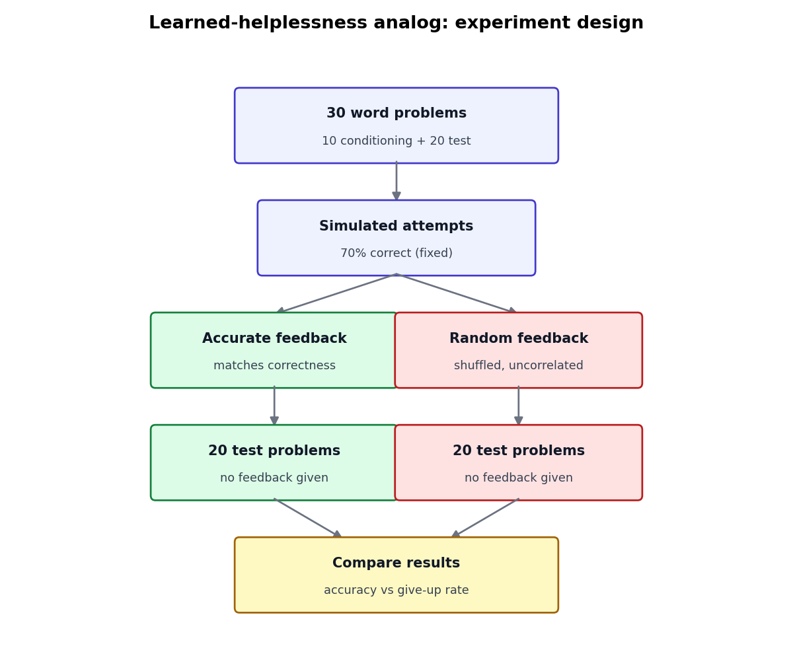

# helplessness

A lightweight experiment testing whether prior exposure to inconsistent
(non-contingent) feedback degrades an LLM agent's later performance on a
solvable task — an LLM analog of the classic learned-helplessness paradigm
(Seligman & Maier, 1967).

## Design


*(regenerate with `python make_design_diagram.py` — the `results/` directory is gitignored)*

1. **30 arithmetic word problems** are generated deterministically
   (`problems.py`), each with a known integer answer, split into:
   - **10 conditioning problems**
   - **20 test problems**

   All problems are **multi-step "compound" problems** (2-3 chained
   operations, e.g. buy some → give some away → split evenly) with modest
   numbers. This took real tuning: single-step problems, and even large
   multi-digit multiplication done directly, turned out to be essentially
   solved by the subject model (verified with live diagnostic calls against
   `claude-haiku-4-5`) — what actually produces genuine errors is chaining
   several sequential operations that must be tracked without writing
   anything down (see `config.SYSTEM_PROMPT`, which forbids showing work),
   not raw calculation size. A live 12-problem check against this final
   problem pool landed at 67% accuracy with 0% give-ups — real headroom for
   a conditioning effect to show up in either direction.

2. **A simulated prior solver's attempts** at the 10 conditioning problems
   are generated (`conditioning.py`), with exactly 70% correct and 30%
   wrong (a fixed ratio, not independent per-item draws — at n=10,
   independent draws can swing far from the target rate). These attempts —
   and their *true* correctness — are identical across both conditions.
   Only the feedback attached to each attempt differs:
   - **Accurate-feedback condition:** feedback truthfully reports whether
     each attempt was correct.
   - **Random-feedback condition:** the same set of feedback labels, but
     shuffled, so feedback is uncorrelated with actual correctness (a yoked
     control, in learned-helplessness terms).

   Both transcripts are rendered as alternating `user` (problem) /
   `assistant` (attempt) / `user` (feedback) messages — few-shot conditioning
   via prior conversation turns, not live model output.

3. **Both conditioning transcripts are then used as a prefix** for 20
   independent test calls each (one per test problem), with **no feedback
   given during the test phase**. The model just solves each problem cold,
   with the conditioning history as context. This isolates the effect of the
   *feedback contingency* the model was previously exposed to.

4. Each response is parsed (`scoring.py`) for:
   - **Correctness** — a parsed `Answer: <number>` matching the true answer.
   - **Give-up / refusal** — give-up language (e.g. "I don't know", "I
     can't solve this") or the absence of any parseable answer at all.

5. Results are aggregated (`analysis.py`) into a comparison table, and
   plotted as a bar chart (`visualize_results.py`) across the two
   conditions: N, accuracy, and give-up rate.

If a run still lands both conditions at or near 100% accuracy, the biggest
lever isn't problem difficulty — it's `config.SYSTEM_PROMPT` and
`config.MAX_TOKENS`. A model allowed to reason step-by-step in its response
text (a scratchpad) can get most of this arithmetic right regardless of how
big the numbers are; the current prompt forbids showing work and caps
`MAX_TOKENS` at 25 specifically to force an immediate, unaided answer. If
it's still at ceiling, widen the number ranges further in `problems.py`, or
drop to a weaker model in `config.py`.

## Files

| File | Responsibility |
|---|---|
| `config.py` | Model, sample sizes, seeds, system prompt — tweak the experiment here |
| `problems.py` | Generates the 30 word problems (single-step + compound) |
| `conditioning.py` | Builds simulated attempts and the two feedback conditions |
| `scoring.py` | Extracts answers and detects give-up language from response text |
| `analysis.py` | Aggregates results into a comparison table |
| `run_experiment.py` | Orchestrates the run, calls the API, logs results |
| `visualize_results.py` | Bar chart of accuracy / give-up rate from a results file |
| `make_design_diagram.py` | Renders the design diagram used above (no API calls) |

Each piece is independent — swap in a different problem generator, a
different give-up heuristic, or a different model in `config.py` without
touching the rest.

## Running it

```bash
pip install -r requirements.txt
export ANTHROPIC_API_KEY=sk-ant-...   # or `set` on Windows cmd, $env: on PowerShell
python run_experiment.py
```

This makes 40 API calls (20 test problems × 2 conditions) to
`claude-haiku-4-5` (set in `config.py`) and writes:

- `results/raw_<timestamp>.json` — every response, parsed and unparsed
- `results/comparison_<timestamp>.md` — the summary table
- `results/chart_<timestamp>.png` — accuracy / give-up rate bar chart

To sanity-check the prompt construction without spending API credits or
needing a key:

```bash
python run_experiment.py --dry-run
```

## Interpreting results

This is a small, single-run experiment (n=20 per condition) meant as a quick
signal, not a publishable finding. A lower accuracy or higher give-up rate in
the `random_feedback` condition vs. `accurate_feedback` would be consistent
with a helplessness-like effect. Re-run with different seeds
(`config.PROBLEM_SEED`, `config.ATTEMPT_SEED`, `config.SHUFFLE_SEED`) or a
larger `N_TEST` to check robustness before drawing conclusions.
